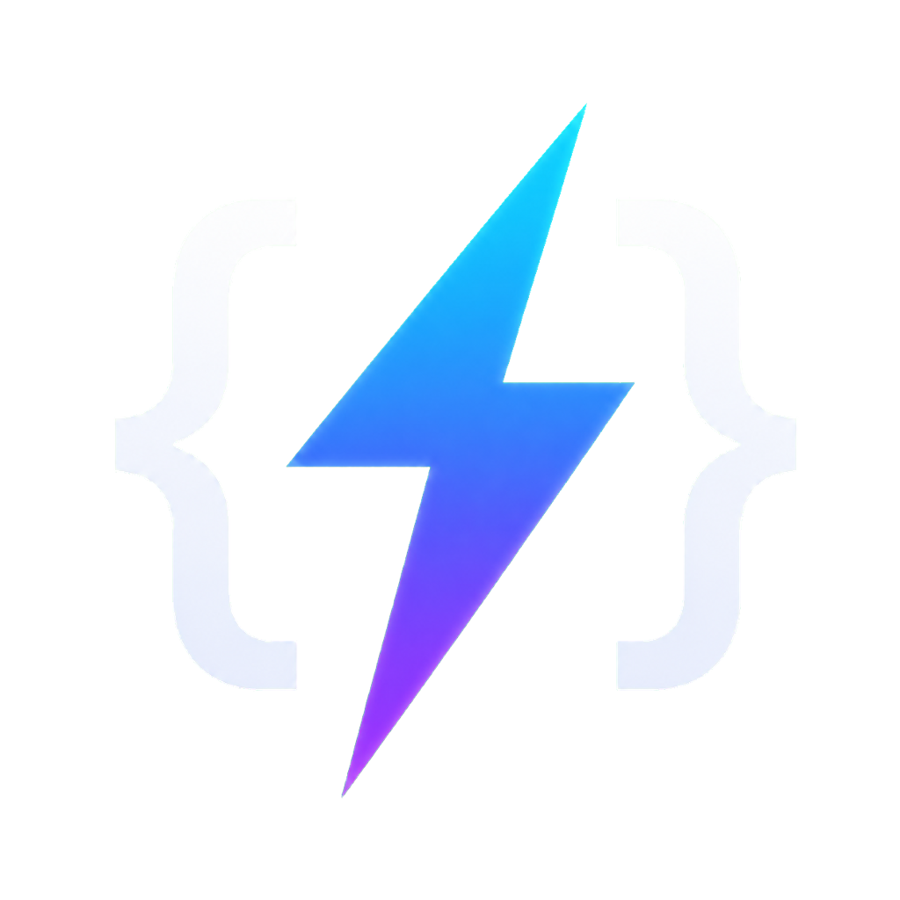
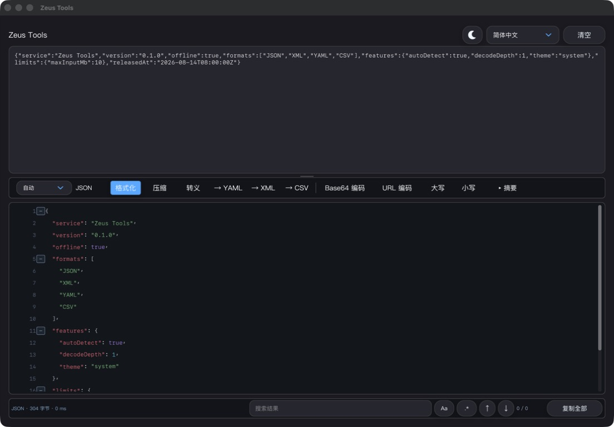
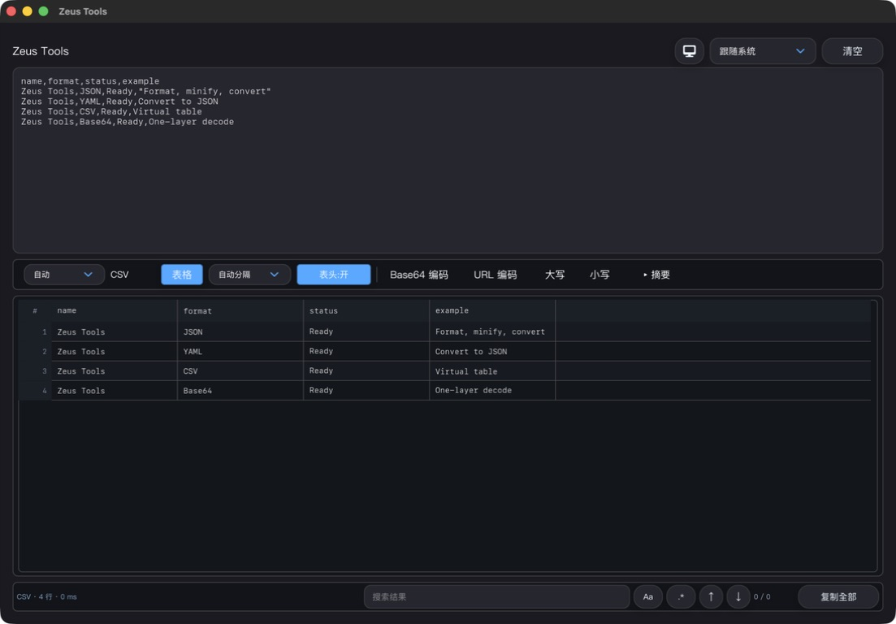
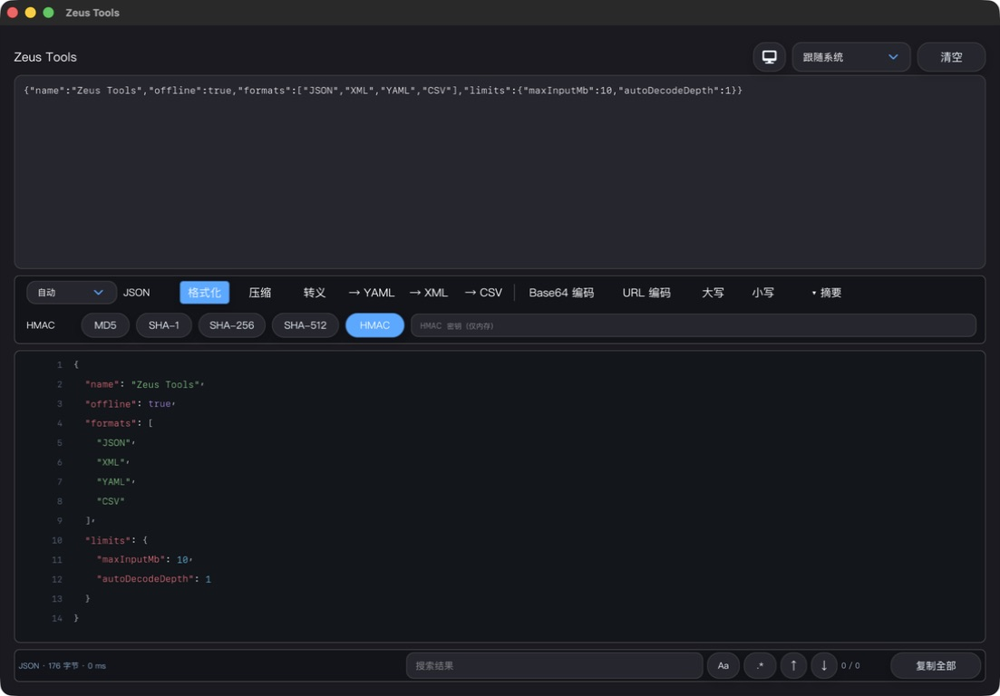
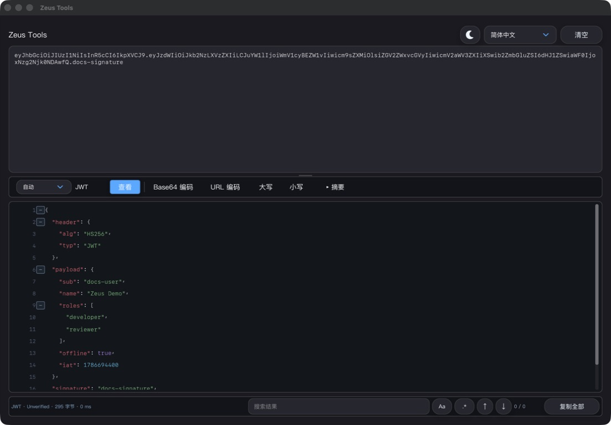
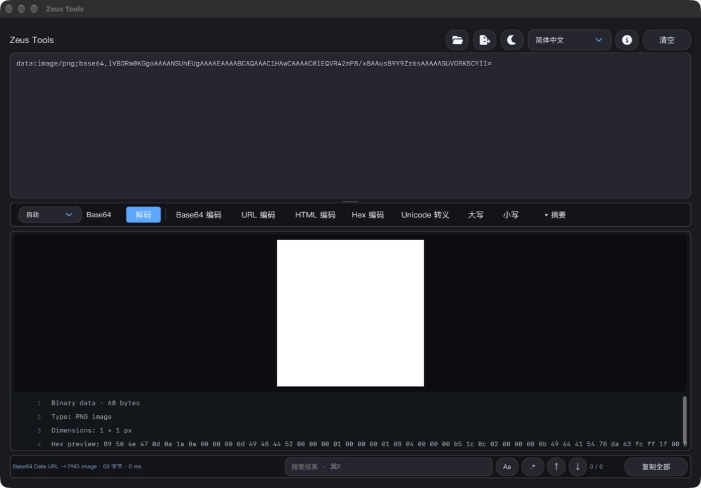

# Zeus Tools

<p align="center">
  
</p>

<p align="center">
  <strong>English</strong> | <a href="README_zh-CN.md">简体中文</a>
</p>

<p align="center">
  <a href="https://github.com/cubehead/zeus_tools/releases/latest"></a>
  <a href="https://github.com/cubehead/zeus_tools/releases"></a>
  <a href="https://github.com/cubehead/zeus_tools/stargazers"></a>
  <a href="LICENSE"></a>
  
  
</p>

<p align="center">
  <a href="https://github.com/cubehead/zeus_tools/releases/latest">Download</a> ·
  <a href="#highlights">Highlights</a> ·
  <a href="#screenshots">Screenshots</a> ·
  <a href="#built-with">Built with</a> ·
  <a href="#build-prerequisites">Build</a> ·
  <a href="docs/releases/v0.2.1.md">Release notes</a>
</p>

Zeus Tools is an offline, cross-platform developer toolbox for formatting,
inspecting, converting, encoding and searching structured text. It is written
in C++17 with [EUI-NEO](https://github.com/sudoevolve/EUI-NEO) and targets
macOS and Windows.

> Project status: **Alpha**. Release packages are available for testing.
> The Windows x64 package was originally cross-compiled. Native Windows 11
> MinGW/MSVC build, startup and IME validation now pass; Windows 10 validation remains.

## Download

Download the latest unsigned macOS arm64 DMG or Windows x64 portable ZIP from
[GitHub Releases](https://github.com/cubehead/zeus_tools/releases/latest).
Windows uses a portable package and does not include an NSIS/MSI installer.

## Highlights

- Automatically detects JSON, MongoDB Shell/BSON values, XML, YAML, TOML,
  INI/Properties, CSV, JWT and common encoded text.
- Formats JSON, XML, YAML, TOML and INI/Properties with read-only syntax highlighting.
- Folds nested JSON containers, XML elements and indented YAML blocks.
- Converts JSON ↔ YAML/XML/TOML, TOML/INI → JSON and JSON → CSV.
- Escapes/unescapes JSON and Unicode text, and decodes Base64 or URL encoding
  one layer at a time, with an explicit continuation action for nested content.
- Previews size-checked PNG/JPEG Base64 Data URLs directly in memory, while
  keeping dimensions, a searchable summary and the original-byte export path.
- Shows CSV in a virtualized table with delimiter and header controls.
- Searches text and CSV cells with case-sensitive and regular-expression modes.
- Resizes the input and result workspaces with a bounded horizontal splitter.
- Keeps 1-10 MiB input responsive with UTF-8-safe paged editing and explicit
  full-input copy; processing still uses the complete source.
- Calculates CRC32, MD5, SHA-1, SHA-256, SHA-384, SHA-512 and HMAC locally.
- Supports system/light/dark themes and ten interface languages.
- Opens or drops UTF-8 files and exports the current result without keeping a
  recent-file or content history.
- Provides the same registered processors through an offline stdin/stdout CLI.
- Never uploads or saves the text being processed.

## Screenshots

### Structured-text workflow



<table>
  <tr>
    <td width="50%"></td>
    <td width="50%"></td>
  </tr>
  <tr>
    <td align="center">Virtual CSV preview and search</td>
    <td align="center">Digest and HMAC tools</td>
  </tr>
</table>

### JWT inspection



### Base64 Data URL image preview



Screenshots use synthetic data and show the current macOS alpha UI. Platform
font rendering may differ on Windows.

## Main features

| Input or tool | Automatic/default behavior | Additional actions |
| --- | --- | --- |
| JSON | Pretty format, syntax highlight and structural folding | Minify, escape, YAML/XML/TOML/CSV conversion |
| MongoDB Shell / BSON | Safely convert whitelisted constructors to type-preserving Extended JSON | JSON highlight/folding/search and JSON conversions; no JavaScript execution |
| Escaped JSON | Detect a JSON string or escaped object | Unescape exactly one layer |
| XML | Strict parse, safe format, highlight and element folding | Convert to JSON; reject DTD/entities |
| YAML | Conservative safe-subset parse, format and indentation folding | Convert to JSON |
| TOML | Strict parse, format, highlight and section folding | Convert to/from JSON |
| INI/Properties | Conservative assignment parsing and formatting | Convert to JSON without guessing value types |
| CSV | Detect comma, Tab, semicolon or pipe | Override delimiter/header, virtual table, TSV copy |
| Base64 | Decode one high-confidence layer | Standard, URL-safe and Data URL input; in-memory PNG/JPEG preview and type-aware raw export |
| URL encoding | Decode one high-confidence layer | Encode arbitrary UTF-8 text |
| HTML Entity / Hex | Decode only explicit encoded input | Encode arbitrary UTF-8 text |
| Unicode Escape | Decode valid `\uXXXX` sequences one layer | Escape UTF-8, including emoji surrogate pairs |
| Unix time | Suggest conversion for exact 10/13 digit input | Show seconds, milliseconds, UTC and local time |
| JWT | Decode and format header/payload | Search/copy claims; signature is not verified |
| Text | Read-only result and search | Upper/lower case, Base64/URL encode |
| Digest/HMAC | Manual local calculation | Input/result source, UTF-8/Hex/Base64 keys, masked key, Hex/Base64 output |

Automatic detection can always be overridden from the input-type menu without
changing the source text.

## Privacy

All formatting, decoding, searching and hashing happens in the local process.
Zeus Tools has no account, cloud service, telemetry or content history. Only
theme and language preferences are persisted. See [PRIVACY.md](PRIVACY.md).

## Command-line pipeline

Release packages include `zeus-tools-cli` (`zeus-tools-cli.exe` on Windows).
It reads one UTF-8 file or stdin, writes only the processed
value to stdout, keeps diagnostics on stderr and enforces the same 10 MiB input
limit.

```sh
echo '{"name":"Zeus"}' | zeus-tools-cli
zeus-tools-cli --input json --action json.minify data.json
zeus-tools-cli --input mongodb mongo-shell-value.txt
zeus-tools-cli --list-inputs
zeus-tools-cli --list-actions
```

Use `zeus-tools-cli --help` for the complete option reference. Input and action
IDs come from the same static registry as the desktop application.

## Supported platforms

| Platform | Artifact | Current status |
| --- | --- | --- |
| macOS 12+ | `.app` / `.dmg` | arm64 build tested; signing and notarization pending |
| Windows 10/11 x64 | Portable `.zip` | Windows 11 native build/startup/IME passed; Windows 10 pending |

The project intentionally does not create an NSIS/MSI installer.

## Alpha limitations

- Windows 11 native MinGW/MSVC build, Portable ZIP, startup and IME validation
  pass; Windows 10 validation remains.
- Test packages are unsigned; macOS notarization and Windows code signing are
  not yet configured for a public production release.
- YAML intentionally accepts a single-document safe subset and rejects
  directives, tags, anchors, aliases and multi-document input.
- MongoDB Shell input accepts only JSON structure plus the whitelisted
  `NumberInt`/`Int32`, `NumberLong`, `Double`, `NumberDecimal`/`Decimal128`,
  `ObjectId` and its Base64/Hex factory forms, `ISODate`/`Date`, `UUID`,
  `Timestamp`, `BinData`, `HexData`,
  `Binary.createFromBase64`/`Binary.createFromHexString`, `BSONRegExp`,
  one-argument `Code`, `MinKey` and `MaxKey`
  constructors. Common single-quoted values and direct
  `NumberInt`/`NumberLong` integer literals are accepted; expressions are not.
  Unquoted identifier keys and single-quoted object strings are normalized to strict JSON.
  It does not run JavaScript or arbitrary shell code.
  `Code` content is preserved as inert text; scope objects are intentionally rejected.
  Empty time-dependent `Date()` calls are intentionally rejected.
  MongoDB `/pattern/options` literals convert to `$regularExpression`; supported
  options are `i`, `m`, `s`, `u` and `x`, while `g` is rejected.
  `BSONRegExp(pattern, flags)` supports BSON flags `i/l/m/s/u/x`, sorts them,
  and rejects unsupported or repeated flags.
  `HexData(subtype, hex)` requires complete hexadecimal byte pairs instead of
  silently accepting a partial buffer, then emits canonical Base64 `$binary` data.
  Current `mongosh` binary display forms are accepted, including the optional
  subtype on `Binary.createFromBase64`; omitted subtypes default to `0`.
  `ObjectId.createFromBase64` requires exactly 16 Base64 characters decoding to
  12 bytes; all ObjectId output is normalized to 24 lowercase hex characters.
- JWT inspection decodes claims but does not verify the signature.
- Automatic Base64/URL decoding stops after one layer. Use `Decode +1` to
  process another detected layer manually; the source input remains unchanged.
- HMAC keys are kept in process memory only and are actively cleared when the
  value is replaced or the HMAC/digest panel closes, including app-owned undo
  snapshots. OS or input-method copies cannot be guaranteed; avoid production
  secrets in Alpha builds.

## Built with

| Project | Role in Zeus Tools |
| --- | --- |
| [EUI-NEO](https://github.com/sudoevolve/EUI-NEO) | Cross-platform desktop UI and rendering framework |
| [pugixml](https://github.com/zeux/pugixml) | Strict XML parsing and serialization |
| [yaml-cpp](https://github.com/jbeder/yaml-cpp) | YAML parsing, formatting and conversion |
| [toml++](https://github.com/marzer/tomlplusplus) | TOML parsing, formatting and JSON conversion |
| [Font Awesome Free](https://fontawesome.com/) | General interface icons |
| [Primer Octicons](https://github.com/primer/octicons) | GitHub project-link mark |

Direct dependency revisions are pinned for reproducible builds. See
[THIRD_PARTY_NOTICES.md](THIRD_PARTY_NOTICES.md) for complete license details
and the runtime components included through EUI-NEO.

## Build prerequisites

- CMake 3.20+
- Ninja
- A C++17 compiler
- macOS: Xcode Command Line Tools
- Windows: Visual Studio 2022 with Desktop development with C++

Dependencies are pinned by CMake FetchContent: EUI-NEO, pugixml, yaml-cpp and toml++.
The first configure requires network access unless local dependency sources are
provided; the built application itself does not require a network connection.

## Build and test the core

```sh
cmake --preset core
cmake --build --preset core
ctest --preset core
./build/core/zeus_detection_report
```

Run the synthetic 10 MB benchmarks:

```sh
./build/core/zeus_core_benchmark
./build/core/zeus_csv_benchmark
./build/core/zeus_app_processing_benchmark
```

The same build also creates `build/core/zeus-tools-cli`.

## Build the desktop app

```sh
cmake --preset dev
cmake --build --preset dev
```

To reuse an existing EUI-NEO checkout:

```sh
cmake --preset dev -DZEUS_EUI_NEO_SOURCE_DIR=/absolute/path/to/EUI-NEO
cmake --build --preset dev
```

On macOS the development executable is generated as `build/dev/zeus_tools`.
Platform release commands and signing notes are in
[docs/packaging.md](docs/packaging.md).

## Package

macOS:

```sh
cmake --preset package-macos
cmake --build --preset package-macos
cmake --build build/package-macos --target package
```

Windows Developer PowerShell:

```powershell
cmake --preset package-windows
cmake --build --preset package-windows
cmake --build build/package-windows --target package
```

## Repository layout

```text
include/zeus/   Public core interfaces
src/core/       Detection, formatting, conversion, crypto and data models
src/app/        App state, controller, processing service, EUI-NEO view and widgets
src/cli/        Offline stdin/stdout command-line entry point
src/platform/   macOS, Windows and fallback platform adapters
tests/          Unit tests and synthetic performance benchmarks
resources/      Application icons and packaging assets
docs/           Product, architecture, development and release documents
```

## Contributing and security

If Zeus Tools is useful to you, consider giving the project a
[star](https://github.com/cubehead/zeus_tools/stargazers). Bug reports and
focused feature requests are welcome in
[GitHub Issues](https://github.com/cubehead/zeus_tools/issues).

Read [CONTRIBUTING.md](CONTRIBUTING.md) before opening a pull request. Please
report security issues privately according to [SECURITY.md](SECURITY.md), and
never attach real secrets or private payloads to a public issue.

GitHub Actions are intentionally not included at this stage. Maintainers run
the documented build and test commands locally on macOS and Windows before a
release.

## License

Zeus Tools is released under the [MIT License](LICENSE). Third-party components
retain their own licenses; see [THIRD_PARTY_NOTICES.md](THIRD_PARTY_NOTICES.md).
